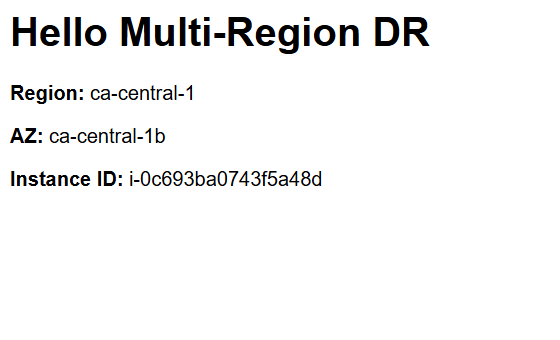

# Project 1 — Multi-Region Disaster Recovery (from scratch)

**Primary Region:** ca-central-1 (Canada Central)  
**Secondary Region:** us-east-1 (N. Virginia)

## Goal
Build a cost-optimized, reproducible multi-region DR reference on AWS using CloudFormation.

## Roadmap
- [ ] Day 1: Hello World EC2 (default VPC) + NGINX
- [ ] Day 2: Custom VPC with public/private subnets (primary)
- [ ] Day 3: Auto Scaling Group (primary)
- [ ] Day 4: Secondary region EC2/ASG
- [ ] Day 5: S3 Cross-Region Replication
- [ ] Day 6: Route 53 failover (health checks)
- [ ] Day 7: RDS Multi-AZ (primary) + alarms
- [ ] Docs: Architecture diagram + screenshots + cleanup

## How to run (Day 1)
See commands in `/cloudformation/day1-ec2.yml` section of this README.
## Day 1 — Result

**Public DNS:** `http://ec2-15-222-10-193.ca-central-1.compute.amazonaws.com`

**What I verified**
- EC2 in ca-central-1 is running and reachable over HTTP (80)
- NGINX serves a page with Region, AZ, and Instance ID

**Screenshot**

