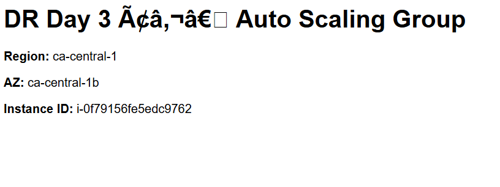
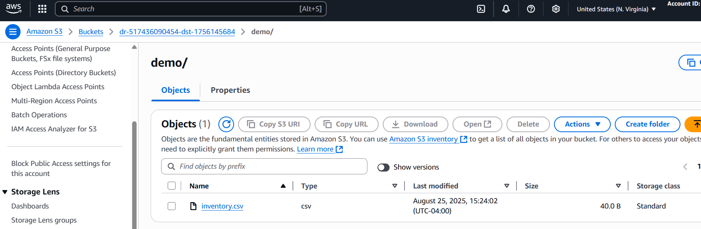

# Project 1 — Multi-Region Disaster Recovery (from scratch)

**Primary Region:** ca-central-1 (Canada Central)  
**Secondary Region:** us-east-1 (N. Virginia)

## Goal
Build a cost-optimized, reproducible multi-region DR reference on AWS using CloudFormation.

## Roadmap
- [ ] Hello World EC2 (default VPC) + NGINX
- [ ] Custom VPC with public/private subnets (primary)
- [ ] Auto Scaling Group (primary)
- [ ] Secondary region EC2/ASG
- [ ] S3 Cross-Region Replication
- [ ] Route 53 failover (health checks)
- [ ] RDS Multi-AZ (primary) + alarms
- [ ] Docs: Architecture diagram + screenshots + cleanup

**Public DNS:** http://ec2-15-222-10-193.ca-central-1.compute.amazonaws.com

**What I verified**
- EC2 in ca-central-1 is running and reachable over HTTP (80)
- NGINX serves a page with Region, AZ, and Instance ID

**Screenshot**

## Custom VPC + Public/Private Subnets (Result)

**Public DNS:** http://ec2-3-96-191-145.ca-central-1.compute.amazonaws.com/

**What I built**
- New VPC (`10.31.0.0/16`) with 2 public and 2 private subnets across 2 AZs
- Internet Gateway + public route table (0.0.0.0/0 → IGW)
- Security group allowing HTTP(80) and SSH(22) for demo
- One EC2 (t3.micro) in Public Subnet 1 serving NGINX

**Screenshot**

## Auto Scaling Group (ASG)

**What I built**
- Launch Template + Auto Scaling Group (min/desired/max = 1) in my Day-2 VPC
- Security Group allows HTTP(80) + SSH(22)
- CloudWatch alarm: in-service instances < 1

**What I tested**
- Reached the ASG-backed instance at http://ec2-99-79-67-101.ca-central-1.compute.amazonaws.com/
- Terminated the instance; ASG launched a replacement automatically

**Screenshot**

## Secondary Region (us-east-1)

**Public DNS:** http://ec2-3-237-201-160.compute-1.amazonaws.com/

**What I built**
- Separate VPC in us-east-1 with 2 public + 2 private subnets
- ASG (min/desired/max = 1) serving the same NGINX page

**Screenshot**

 

## Regional Failover Demonstration (no custom domain) 

**Goal:** Prove that the application can continue serving traffic from a **secondary region** when the **primary region** becomes unavailable.

### Architecture
- **Primary:** ca-central-1 — Auto Scaling Group (desired=1) serving NGINX
- **Secondary:** us-east-1 — Auto Scaling Group (desired=1) serving the same page
- **Health Signal:** HTTP 200 from `/`
- **Client Fallback Tester:** A small PowerShell loop that hits the primary; on failure, it falls back to the secondary

### Endpoints
- Primary: http://ec2-15-156-193-103.ca-central-1.compute.amazonaws.com/

- Secondary: http://ec2-34-201-48-251.compute-1.amazonaws.com/

### What I did
1. Verified the primary endpoint returns **200 OK**.
2. Ran a **fallback tester** (`demo/failover_tester.ps1`) that polls the primary and automatically switches to the secondary if the primary fails.
3. **Simulated an outage** by scaling the primary ASG to zero instances.
4. Observed the tester switch from `PRIMARY OK` to `PRIMARY FAIL -> fallback` and then `SECONDARY OK`.
5. **Restored** the primary ASG and confirmed traffic returned to `PRIMARY OK`.

### Commands I used (for reproducibility)

Scale primary to 0 (simulate failure):
`bash
ASG_PRI=$(aws cloudformation describe-stack-resource \
  --stack-name dr-day3-asg \
  --logical-resource-id ASG \
  --region ca-central-1 \
  --query "StackResourceDetail.PhysicalResourceId" --output text)

aws autoscaling update-auto-scaling-group \
  --auto-scaling-group-name "$ASG_PRI" \
  --desired-capacity 0 --min-size 0 \
  --region ca-central-1
aws autoscaling update-auto-scaling-group \
  --auto-scaling-group-name "$ASG_PRI" \
  --desired-capacity 1 --min-size 1 \
  --region ca-central-1

**Screenshots**

## S3 Cross-Region Replication (CRR)

**What I built**
- Versioned, encrypted S3 buckets in two regions:
  - Source (ca-central-1): `s3://<YOUR_SRC_BUCKET>`
  - Destination (us-east-1): `s3://<YOUR_DST_BUCKET>`
- IAM replication role assumed by S3
- Replication rule: all objects from source → destination

**What I tested**
- Uploaded `demo/inventory.csv` to the source bucket
- Verified the object appeared in the destination bucket automatically

**Screenshots**

## RDS Connectivity Test 

**What I built**
- RDS MySQL (Single-AZ, db.t3.micro) in private subnets of the primary VPC
- SG allows MySQL (3306) only from within the VPC CIDR

**What I tested**
- Connected from the primary EC2 to the RDS endpoint
- Created table `items` and inserted sample rows; verified with `SELECT * FROM items;`

**Screenshots**

## Monitoring & Alerts (CloudWatch + SNS)

**What I built**
- **SNS Topic:** `dr-alerts` (email subscription confirmed).
- **CloudWatch Alarms (ca-central-1):**
  - `dr-Primary-ASG-InService-0` — Namespace **AWS/AutoScaling**, metric **GroupInServiceInstances**, alarm when **< 1** for 1 minute. Action: publish to `dr-alerts`.
  - `dr-Primary-EC2-CPU-High` — Namespace **AWS/EC2**, metric **CPUUtilization**, alarm when **> 80%** for 10 minutes (period 300s × 2). Action: publish to `dr-alerts`.

**What I tested**
- Confirmed the SNS email subscription and received a **test publish**.
- **Simulated an outage:** set the primary ASG `desired=0` → `dr-Primary-ASG-InService-0` moved to **ALARM** and sent an email notification.
- Restored the primary ASG `desired=1` → alarm returned to **OK** and a recovery email arrived.

**Commands I used (for reproducibility)**

# Create topic + subscribe (replace with your email)
REGION=ca-central-1
TOPIC_ARN=$(aws sns create-topic --name dr-alerts --region $REGION --query TopicArn --output text)
aws sns subscribe --topic-arn "$TOPIC_ARN" --protocol email --notification-endpoint "<your-email>" --region $REGION

# Get ASG + one instance id
ASG_PRI=$(aws cloudformation describe-stack-resource --stack-name dr-day3-asg --logical-resource-id ASG --region $REGION --query "StackResourceDetail.PhysicalResourceId" --output text)
IID_PRI=$(aws autoscaling describe-auto-scaling-groups --region $REGION --auto-scaling-group-names "$ASG_PRI" --query "AutoScalingGroups[0].Instances[?LifecycleState=='InService'].InstanceId | [0]" --output text)

# Alarm 1: primary ASG has <1 InService
aws cloudwatch put-metric-alarm \
  --alarm-name "dr-Primary-ASG-InService-0" \
  --alarm-description "Alert when primary ASG has <1 InService instance" \
  --namespace "AWS/AutoScaling" --metric-name "GroupInServiceInstances" \
  --dimensions Name=AutoScalingGroupName,Value="$ASG_PRI" \
  --statistic Average --period 60 --evaluation-periods 1 --datapoints-to-alarm 1 \
  --threshold 1 --comparison-operator LessThanThreshold --unit Count \
  --treat-missing-data breaching \
  --alarm-actions "$TOPIC_ARN" --ok-actions "$TOPIC_ARN" \
  --region $REGION

# Alarm 2: EC2 CPU > 80% for 10 minutes
aws cloudwatch put-metric-alarm \
  --alarm-name "dr-Primary-EC2-CPU-High" \
  --alarm-description "CPU > 80% for 10 minutes" \
  --namespace "AWS/EC2" --metric-name "CPUUtilization" \
  --dimensions Name=InstanceId,Value="$IID_PRI" \
  --statistic Average --period 300 --evaluation-periods 2 --datapoints-to-alarm 2 \
  --threshold 80 --comparison-operator GreaterThanThreshold \
  --treat-missing-data notBreaching \
  --alarm-actions "$TOPIC_ARN" --ok-actions "$TOPIC_ARN" \
  --region $REGION

**Screenshots**
- 
- 
- 
  

